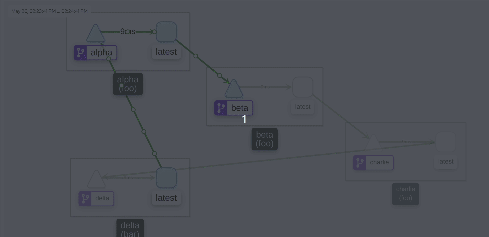
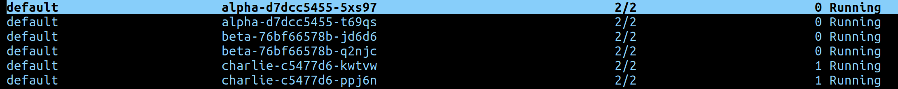

# istio-service-tester
<a href="https://codeclimate.com/github/AlexsJones/istio-service-tester/maintainability"></a>


Use this to test if your mesh is working.

- All code included
- Uses HTTP/2
- Creates four basic GRPC services that talk to each other.

It has proven useful for sanity checks...






```
./install_services.sh
```


Or customise to fit your usecase...

```
helm install test-istio . \
--set=image.repository=myproxy/tibbar/istio-service-tester:latest --set=gateway=foo.istio-system.svc.cluster.local
```
