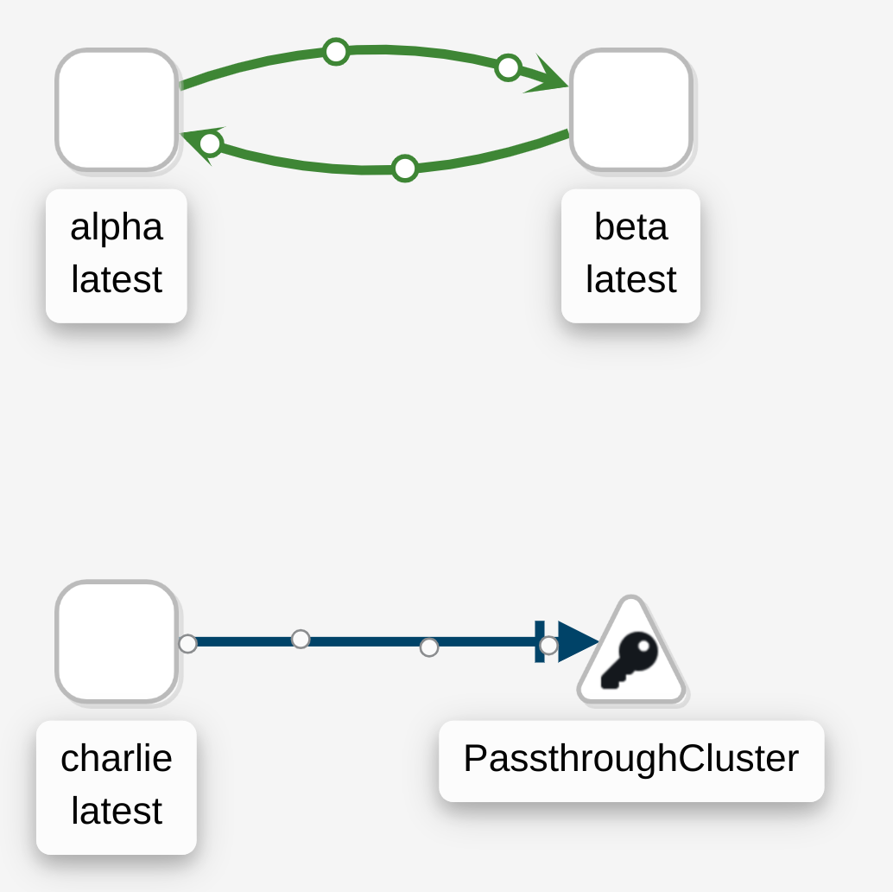

# istio-service-tester

Use this to test if your mesh is working.

This creates a pair of basic GRPC services in a namespace you have already enabled.
It also creates a single service that will default to trying to hit an external endpoint.

It has proven useful for sanity checks...





```
kubectl label ns/default istio-injection=enabled
helm install test-istio .
```


Or customise to fit your usecase...

```
helm install test-istio . \
--set=image.repository=myproxy/tibbar/istio-service-tester:latest --set=gateway=foo.istio-system.svc.cluster.local
```
